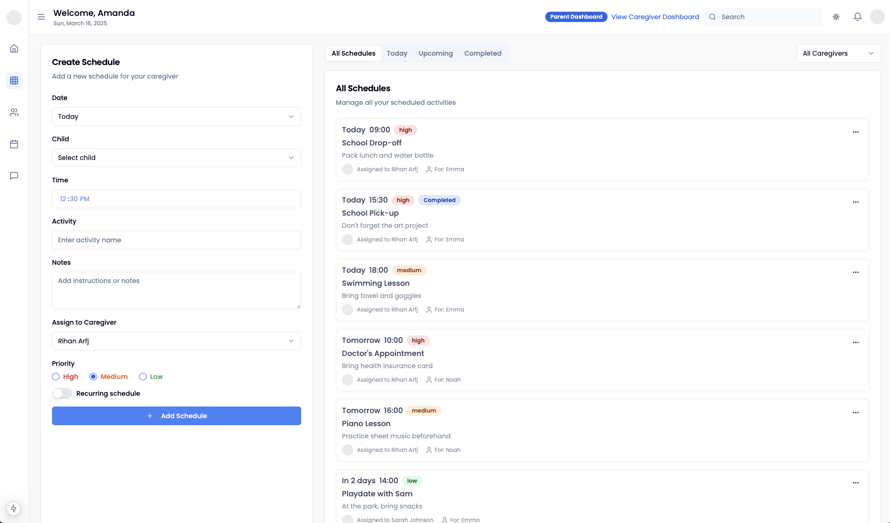

# Caregiver Schedule Update Guide

This guide explains how to update your child's schedule using the parent portal.

## Accessing the Schedule Update Feature

1. Log into the parent portal using your credentials
2. Navigate to "Schedule Management" in the sidebar menu
3. Click on "Update Schedule"

## Schedule Update Process

### Using the Visual Schedule Builder

The visual schedule builder allows you to easily create and modify your child's daily schedule:

1. Click on any time slot to add or edit an activity
2. Drag activities to reorder them
3. Use the color coding system to categorize activities:
   - Blue: Learning activities
   - Green: Outdoor/physical activities  
   - Yellow: Meals and snacks
   - Purple: Rest periods
   - Gray: Transitions/other

### Important Notes

- Schedule changes take effect the next business day
- Please submit updates by 6 PM for next-day changes
- Contact your center director for same-day urgent changes
- You can save draft schedules before finalizing

## Tips for Effective Scheduling

- Maintain consistent meal and nap times
- Balance active and quiet activities
- Include transition periods between activities
- Consider your child's natural energy patterns

## Need Help?

If you need assistance with schedule updates:
- Review our [FAQ section](./faq)
- Email support@caregivercenter.com
- Call your center director during business hours

---

*Note: The schedule builder interface may vary slightly based on your device and browser.*
